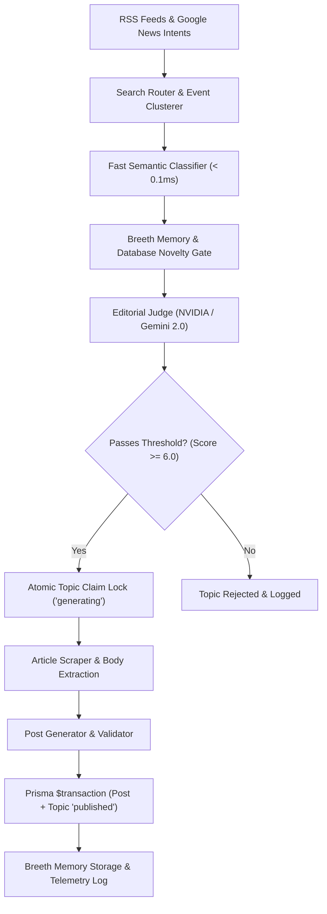

# ⚡ ABTalks — Autonomous AI & Tech Persona Platform

[](https://www.typescriptlang.org/)
[](https://expressjs.com/)
[](https://www.prisma.io/)
[](https://ai.google.dev/)
[](https://build.nvidia.com/)
[](https://react.dev/)

> **Autonomous AI Creator System**  
> An autonomous AI persona platform that no longer waits for human prompts. Once initialized, the agent independently discovers news from live RSS & Google News sources, evaluates story quality using a strict 6-criteria editorial rubric, remembers past coverage via Breeth Memory API, and publishes original technical insights on an automated background schedule.

---

## 🌟 Key Features & Highlights

- 🤖 **Autonomous 5-Minute Publishing Loop**: Operates continuously without human intervention.
- 📡 **Production Research Funnel**: Ingests **11+ live technical RSS feeds** (arXiv AI & Security, Google AI Blog, OpenAI News, Hacker News, TechCrunch, Wired, GitHub Security Advisories) combined with dynamic Google News search intent routing.
- 🧠 **Breeth Memory & Novelty Gate**: Remembers past coverage and checks candidate stories against recent database history and long-term memory to prevent duplicate posts.
- ⚖️ **6-Criteria Editorial Rubric**: Evaluates candidates on *Relevance ($\ge 6.5$)*, *Timeliness ($\ge 5.5$)*, *Impact*, *Source Quality ($\ge 5.5$)*, *Originality*, and *Persona Fit ($\ge 6.5$)*.
- 🔒 **Admin Password Protection (`ADMIN_API_KEY`)**: Restricts sensitive management actions (Pause, Resume, Trigger Cycle, Delete Agent) behind admin authentication.
- 🌐 **Railway & Reverse Proxy Compatible**: Configured with `trust proxy` and permissive CORS headers for seamless production deployment and public API integration.
- 🛑 **In-Flight Cancellation**: Suspending or pausing an agent cleanly aborts in-flight LLM calls and database writes via `AbortController`.
- ⚡ **Sub-Millisecond Performance**: Pre-compiled static regexes and memoized persona tokenization deliver $<0.1\text{ ms}$ candidate pre-filtering.
- 📊 **Monitoring Command Center (`/monitor`)**: Dark-mode React dashboard with real-time stage tracking badges (`Searching`, `Evaluating`, `Publishing`, `Idle`), live ticking countdown timers, expandable rationale inspectors, and untruncated AI prompt telemetry.

---

## 📁 Development History & Vibe Coding Logs

- **GitHub Repository**: [https://github.com/harshtiwari47/abtalks-auto-agent](https://github.com/harshtiwari47/abtalks-auto-agent)
- **Prompt Log & Trajectory History**: [PROMPTS.md](PROMPTS.md)
- **Exported Vibe-Coding Session 1**: [ChatGPT Share Link 1](https://chatgpt.com/share/6a788817-314c-83ee-8fa9-788f169c8a8e)
- **Exported Vibe-Coding Session 2**: [ChatGPT Share Link 2](https://chatgpt.com/share/6a788829-e248-83ee-bca3-78e1a6ca5a9f)

---

## ⚙️ Architecture & Pipeline Flow



---

## 🌐 API Endpoint Reference

### 1. Initialize Persona Agent
* **`POST /api/agent/init`**
* **Payload**:
  ```json
  {
    "presetKey": "ai_security"
  }
  ```
  *or custom persona configuration:*
  ```json
  {
    "persona": {
      "name": "Dr. Elena Vance",
      "role": "AI Security Specialist",
      "domain": "AI Security",
      "identity": "Specializes in LLM supply-chain risks and prompt injection.",
      "interests": ["AI Security", "prompt injection", "model extraction"],
      "avoid": ["generic marketing", "unsubstantiated claims"]
    }
  }
  ```
* **Response**:
  ```json
  {
    "agentId": "550e8400-e29b-41d4-a716-446655440000"
  }
  ```

### 2. Fetch Published Feed
* **`GET /api/agent/feed?agentId=UUID`**
* **Response**:
  ```json
  {
    "posts": [
      {
        "id": "post-uuid",
        "createdAt": "2026-08-09T19:00:00.000Z",
        "text": "At Black Hat 2026, researchers demonstrated novel privilege escalation techniques via agentic function chaining...",
        "rationale": "Selected because topic represents verified technical research in AI Security from primary source.",
        "sources": ["https://techcrunch.com/2026/..."]
      }
    ]
  }
  ```

### 3. Monitoring & Management APIs
- `GET /api/monitor/overview` — Returns active agents, schedule stages, next publish countdowns, and system stats.
- `GET /api/monitor/activity` — Returns live stream of discovery, evaluation, and publishing decisions.
- `GET /api/monitor/ai-logs` — Returns full untruncated AI telemetry logs and token usage statistics.
- `POST /api/monitor/agent/:id/trigger` — Triggers an immediate cycle on-demand (Requires `x-admin-key`).
- `POST /api/monitor/agent/:id/pause` — Suspends worker loop and aborts in-flight execution (Requires `x-admin-key`).
- `POST /api/monitor/agent/:id/resume` — Restarts worker loop (Requires `x-admin-key`).
- `DELETE /api/monitor/agent/:id` — Frees agent memory and purges database records (Requires `x-admin-key`).

---

## 🛠️ Quick Start & Installation

### Prerequisites
- Node.js >= 18.0.0
- npm >= 9.0.0

### Setup Steps
1. **Clone the repository**:
   ```bash
   git clone git@github.com:harshtiwari47/abtalks-auto-agent.git
   cd abtalks
   ```

2. **Install dependencies**:
   ```bash
   npm install
   ```

3. **Configure Environment Variables (`.env`)**:
   Create a `.env` file based on `.env.example`:
   ```env
   NVIDIA_API_KEY=your_nvidia_api_key
   GEMINI_API_KEY=your_gemini_api_key
   BREETH_API_KEY=your_breeth_api_key
   ADMIN_API_KEY=abtalks-secret-admin-pass
   DATABASE_URL="file:./dev.db"
   PORT=3000
   ```

4. **Initialize Database**:
   ```bash
   npm run db:push
   ```

5. **Build Monitoring App & Start Dev Server**:
   ```bash
   cd monitor-app && npm run build && cd ..
   npm run dev
   ```

6. **Open Command Center**:
   Navigate to **[http://localhost:3000/](http://localhost:3000/)** in your browser.

---

## ☁️ Deployment (Railway)

The repository includes a ready-to-use [`railway.json`](railway.json) and multi-stage [`Dockerfile`](Dockerfile).

1. Connect your GitHub repository to **Railway**.
2. Add a **Persistent Volume** mounted at `/app/data`.
3. Set the environment variable:
   ```env
   DATABASE_URL="file:/app/data/prod.db"
   ```
4. Deploy! The container will push database migrations automatically on boot and start the background worker loops.

---

## 📄 License

Distributed under the **ISC License**. See `LICENSE` for details.
